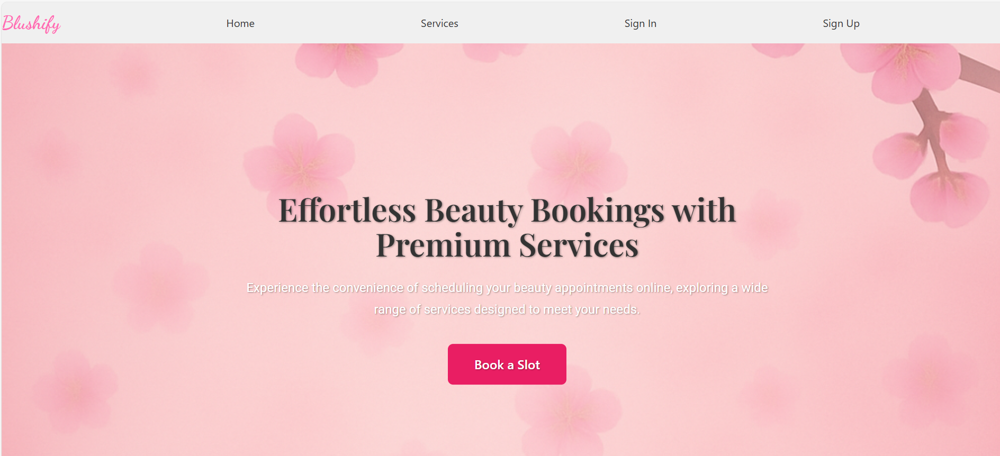
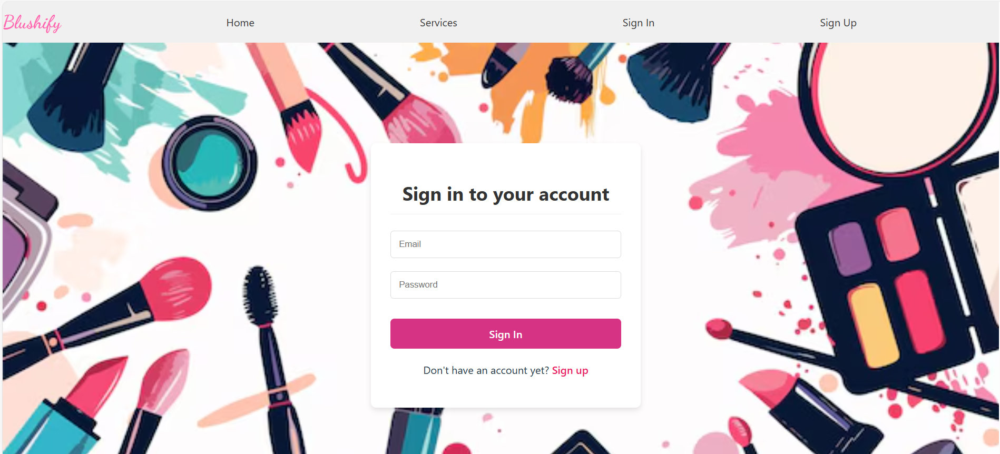
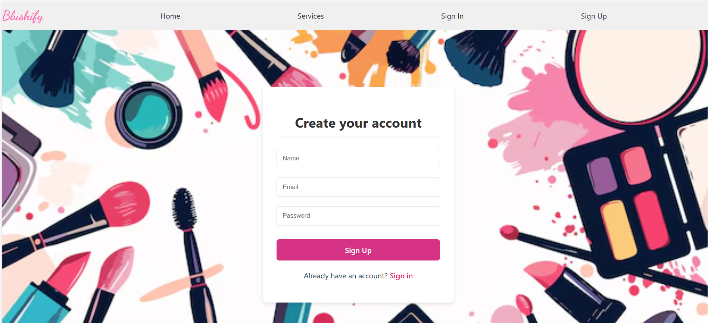
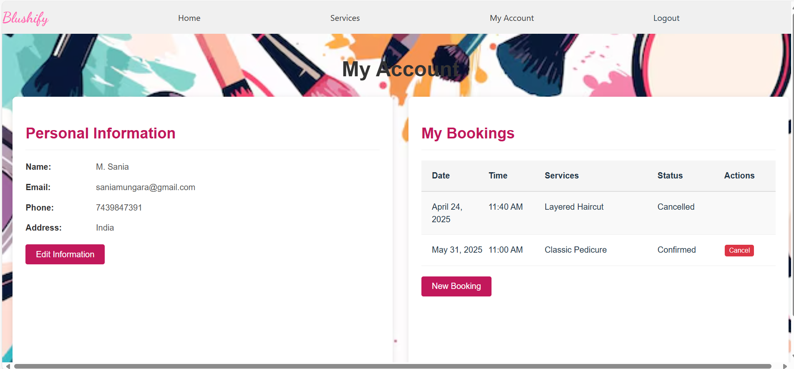
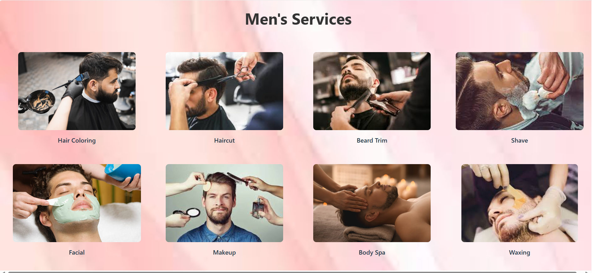
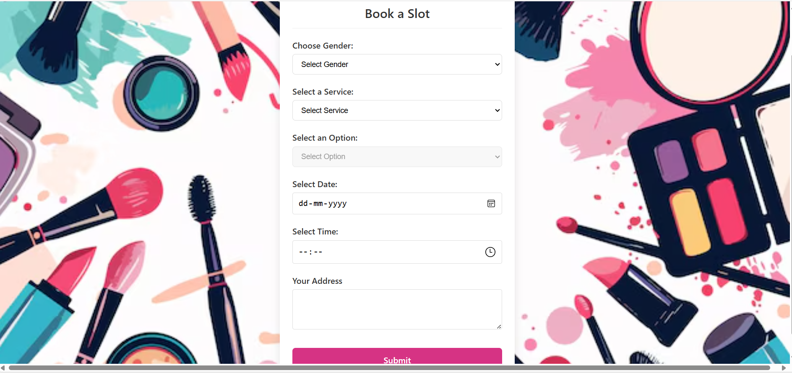

# Blushify E-Commerce Project 💄✨

A full-stack e-commerce application designed to manage user profiles and booking services with ease and security.

---

## Features

- **User Authentication:** Secure signup and login with encrypted passwords.
- **Profile Management:** Easily view and update personal details including name, email, phone, and address.
- **Booking Management:** Create, view, and manage beauty service bookings seamlessly.
- **Account Dashboard:** A centralized hub for managing profiles and bookings.
- **Logout:** Safely log out from your account anytime.

---
## 📸 Project Screenshots

### 🏠 Homepage


### 🔐 Sign In


### 📝 Sign Up


### 👤 My Account


### 👨 Men Services


### 👩 Women Services


### 📅 Booking Slot


---
## Project Overview

The project is divided into two main parts:

### Backend

Handles API endpoints, user authentication, booking logic, and database operations.

### Frontend

A sleek React-based user interface for seamless interaction with the backend, including forms, navigation, and responsive design.

---

## Tech Stack

| Backend                         | Frontend                     |
|---------------------------------|------------------------------|
| Node.js                         | React.js                     |
| Express.js                      |  axios                       |
| MongoDB (with Mongoose)         | @radix-ui/react-label        |
| JWT for Authentication          | @radix-ui/react-slot         |
| bcryptjs                        | classnames / clsx            |
| CORS, dotenv, express-validator | formik, lucide-react         |
|                                 | react-datepicker             |
|                                 | react-router-dom             |
|                                 | tailwind-merge, yup          |

---

## How to Clone and Setup

1. Open your terminal or command prompt.

2. Clone the repository:

    ```bash
    git clone https://github.com/saniamungara/Micro_IT_Project.git
    ```

3. Navigate into the e-commerce project folder:

    ```bash
    cd Micro_IT_Project/Micro_IT_ECommerce_Project
    ```

4. Backend Setup:

    - Go to the backend directory and install dependencies:

        ```bash
        cd backend
        npm install
        ```

    - Create a `.env` file with your MongoDB connection string and secret key:

        ```
        PORT=5000
        MONGODB_URL=<Your MongoDB Connection String>
        JWT_SECRET=<Your Secret Key>
        ```

    - Start the backend server:

        ```bash
        npm run start
        ```

5. Frontend Setup:

    - Open a new terminal, navigate to the frontend folder:

        ```bash
        cd ../frontend
        npm install
        ```

    - Start the frontend development server:

        ```bash
        npm run dev
        ```

6. Open your browser and visit the frontend URL (usually `http://localhost:3000` or as shown in your terminal).

7. Use the app to register, login, manage profile, and book beauty services.

---

## Future Improvements

- Add product management features.
- Implement shopping cart and checkout flow.
- Integrate payment gateways.
- Improve UI/UX design and responsiveness.
- Add automated tests for backend and frontend.
- Deploy the project to cloud hosting.

---

## Contact

For any questions or contributions, please reach out:

**Name:** Sania Mungara  
**Email:** saniamungara@gamil.com 
**GitHub:** https://github.com/saniamungara

