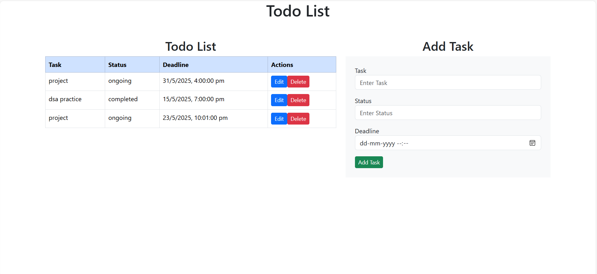

# 📝 To-Do List 

A simple MERN stack To-Do List application to add, delete, and manage tasks.

---

## 📁 Project Structure

```
ToDo_List/
│
├── backend/
│   ├── models/
│   ├── routes/
│   └── server.js
│
├── frontend/
│   ├── public/
│   └── src/
│       ├── components/
│       ├── App.js
│       └── index.js
│
├── README.md
└── package.json
```

---

## ⚙️ Tech Stack

- **MongoDB** – Database
- **Express.js** – Backend
- **React.js** – Frontend
- **Node.js** – Runtime

---

## 💡 Features

- Add tasks
- Delete tasks
- Mark tasks as completed
- Responsive UI

---

## 📷 Screenshots



---

## 🚀 How to Run the Project

### 1. Clone the repository

```bash
git clone https://github.com/YOUR_USERNAME/REPO_NAME.git
```

### 2. Start the backend

```bash
cd backend
npm install
npm start
```

### 3. Start the frontend

```bash
cd frontend
npm install
npm start
```

---

## Contact
For any questions or contributions, please reach out:

Name: Sania Mungara
Email: saniamungara@gamil.com GitHub: https://github.com/saniamungara